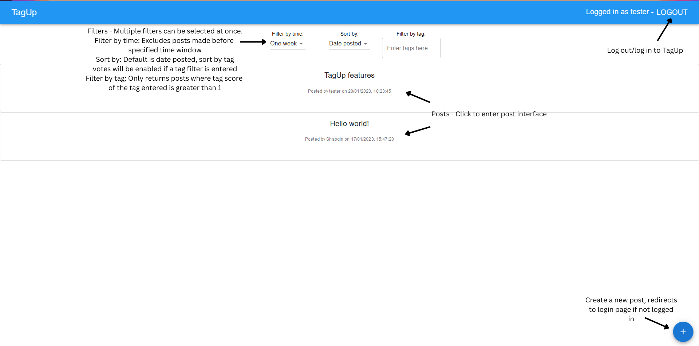
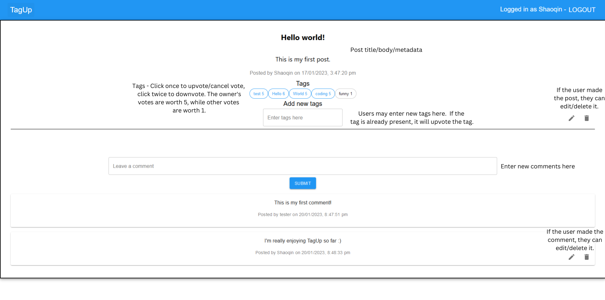

# CVWO Assignment Project - TagUp

TagUp is designed to be a simple, easy-to-use forum with the unique feature of community tagging, meaning the community can decide what tags should be attached to a post. 

Users can view, filter, and open posts without logging in, but an account is required to post, comment, and add or vote on tags. To make an account, simply head to the signup page and enter a name and a password. 

There are no fixed tags in TagUp, meaning users can tag a post with whatever they wish. To add a tag either when making or viewing a post, simply type the new tag into the provided text box and hit Enter. To upvote or revoke your upvote from a tag while viewing the post, press it once. To downvote a tag, give it a double-click.

Homepage

Post view

The backend for this project can be found [here](https://github.com/lshaoqin/cvwo_forum_backend).

## Acknowledgements

This project was bootstrapped with [Create React App](https://github.com/facebook/create-react-app).
This project uses [MUI](https://mui.com/),
[TypewriterJS](https://github.com/tameemsafi/typewriterjs#readme),
[ESLint](https://eslint.org/), [Prettier](https://prettier.io/).
